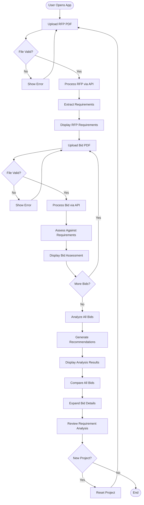

# RFP Bid Assessment Tool

A Next.js application that helps organizations efficiently evaluate multiple bids against Request for Proposal (RFP) requirements. Upload an RFP document, and the tool automatically extracts requirements and assesses how well each bid satisfies them.

## Overview

The RFP Bid Assessment Tool streamlines the bid evaluation process by:

- **Automatically extracting requirements** from RFP PDF documents and organizing them by category
- **Assessing bid compliance** by analyzing bid documents against RFP requirements
- **Providing detailed scoring** with satisfaction percentages and requirement-by-requirement analysis
- **Enabling side-by-side comparison** of multiple bids with expandable detail views
- **Generating comprehensive analysis** with recommendations, reasoning, and open questions for each bidder

## Features

- 📄 **PDF Upload**: Drag-and-drop or file picker interface for uploading RFP and bid documents
- 🤖 **AI-Powered Extraction**: Automatic requirement extraction and categorization using Claude Haiku 4.5 (not Sonnet)
- ✅ **Requirement Assessment**: Each bid is evaluated against all RFP requirements with satisfaction status
- 📊 **Visual Scoring**: Color-coded satisfaction percentages (green/yellow/red) for quick comparison
- 📋 **Detailed Analysis**: Expandable bid cards showing requirement-by-requirement assessment with reasoning
- 🎯 **Comprehensive Bid Analysis**: Analyze all bids together to get recommendations, reasoning, and open questions per company
- ❓ **Open Questions Generation**: Automatically generates specific questions for each bidder to clarify gaps or ambiguities
- 💾 **Local Persistence**: Project data (RFP, bids, and analysis) automatically saved to browser localStorage
- 🌙 **Dark Mode**: Full dark mode support for comfortable viewing
- 🔄 **Multiple Bids**: Upload and compare multiple bids against the same RFP
- 🆕 **Project Management**: Easy project reset to start fresh assessments
- ⚡ **Auto-Processing**: Files are automatically processed when selected (no manual upload button needed)

## Tech Stack

- **Framework**: Next.js 16 (App Router)
- **UI Library**: React 19
- **Language**: TypeScript
- **Styling**: Tailwind CSS 4
- **AI Integration**: AI SDK with Anthropic Claude Haiku 4.5 (via Vercel AI Gateway) - Note: This uses Claude Haiku 4.5, not Sonnet
- **File Storage**: Vercel Blob Storage (temporary)
- **Validation**: Zod for schema validation
- **Package Manager**: pnpm

## Architecture

### Application Structure

The application follows Next.js App Router conventions:

```
src/
├── app/
│   ├── api/
│   │   ├── process-rfp/
│   │   │   └── route.ts      # RFP processing endpoint
│   │   ├── process-bid/
│   │   │   └── route.ts      # Bid assessment endpoint
│   │   └── analyze-all/
│   │       └── route.ts      # Comprehensive bid analysis endpoint
│   ├── page.tsx              # Main application UI
│   ├── layout.tsx             # Root layout
│   └── globals.css           # Global styles
```

### API Routes

#### `/api/process-rfp` (POST)

Processes an RFP PDF document and extracts structured data.

**Request:**
- Method: `POST`
- Body: `FormData` with `file` field containing a PDF file

**Response:**
```typescript
{
  output: {
    title: string;
    rawText: string;
    requirements: Array<{
      text: string;
      category: string;
    }>;
  }
}
```

**Process:**
1. Validates PDF file (type and 10MB size limit)
2. Uploads file to Vercel Blob storage temporarily
3. Uses Claude Haiku 4.5 (via Vercel AI Gateway) to extract title, raw text, and categorized requirements
4. Cleans up temporary blob file
5. Returns structured RFP data

#### `/api/process-bid` (POST)

Processes a bid PDF document and assesses it against RFP requirements.

**Request:**
- Method: `POST`
- Body: `FormData` with:
  - `file`: PDF file
  - `requirements`: JSON stringified array of RFP requirements

**Response:**
```typescript
{
  output: {
    title: string;
    rawText: string;
    totalCost: number;
    timeline: string;
    requirements: Array<{
      text: string;
      category: string;
      isSatisfied: boolean;
      reason: string;
    }>;
  }
}
```

**Process:**
1. Validates PDF file and requirements JSON
2. Uploads file to Vercel Blob storage temporarily
3. Uses Claude Haiku 4.5 (via Vercel AI Gateway) to extract bid information and assess each requirement
4. Cleans up temporary blob file
5. Returns bid data with requirement satisfaction analysis

#### `/api/analyze-all` (POST)

Performs comprehensive analysis of all submitted bids against the RFP to provide recommendations and identify open questions.

**Request:**
- Method: `POST`
- Body: JSON object with:
  - `rfp`: RFP data object (title, rawText, requirements array)
  - `bids`: Array of bid data objects

**Response:**
```typescript
{
  output: {
    recommendation: string;
    mainRecommendationReason: string;
    supportingRecommendationPoints: string[];
    openQuestions: Array<{
      companyName: string;
      openQuestions: string[];
    }>;
  }
}
```

**Process:**
1. Validates RFP data and bids array
2. Uses Claude Haiku 4.5 (via Vercel AI Gateway) to analyze all bids comprehensively
3. Generates recommendation for best bid with detailed reasoning
4. Identifies specific open questions for each company (4-5 deal-breaker questions per company)
5. Returns analysis results with recommendation and open questions

### Data Flow

1. **RFP Processing Flow**:
   - User uploads RFP PDF → File validated → Uploaded to Vercel Blob → Claude Haiku 4.5 (via AI Gateway) extracts requirements → Data returned → Blob cleaned up → Requirements displayed

2. **Bid Assessment Flow**:
   - User uploads bid PDF → File validated → Uploaded to Vercel Blob → Claude Haiku 4.5 (via AI Gateway) assesses against RFP requirements → Data returned → Blob cleaned up → Bid added to comparison list

3. **Analysis Flow**:
   - User clicks "Analyze All Bids" → RFP data and all bids sent to API → Claude Haiku 4.5 (via AI Gateway) analyzes all bids comprehensively → Recommendation, reasoning, and open questions returned → Analysis results displayed

4. **Client-Side State**:
   - RFP data, bids, and analysis results stored in React state
   - Automatically persisted to localStorage (including analysis data)
   - Restored on page reload

## User Flows

### Primary Workflow



### Key User Actions

1. **Upload RFP**: Drag-and-drop or click to upload RFP PDF (max 10MB) - automatically processes when selected
2. **View Requirements**: Automatically extracted requirements displayed by category
3. **Upload Bids**: Upload multiple bid PDFs (one at a time) - automatically processes when selected
4. **Review Assessments**: Each bid shows:
   - Satisfaction percentage
   - Total cost
   - Timeline
   - Requirement-by-requirement analysis
5. **Analyze All Bids**: Click "Analyze All Bids" button to get:
   - Recommendation for best bid
   - Detailed reasoning and supporting points
   - Open questions for each company (4-5 deal-breaker questions)
6. **Compare Bids**: Side-by-side comparison with expandable detail views
7. **Start New Project**: Reset button clears all data (RFP, bids, and analysis) and starts fresh

## Getting Started

### Prerequisites

- Node.js 18+ 
- pnpm (package manager)
- Vercel account (for Blob storage and AI Gateway)
- Vercel AI Gateway API key

### Installation

1. Clone the repository:
```bash
git clone <repository-url>
cd rfp-mvp
```

2. Install dependencies:
```bash
pnpm install
```

3. Set up environment variables:

Copy the example environment file and fill in your values:

```bash
cp example.env .env.local
```

Edit `.env.local` with your credentials:

```env
# AI Gateway API Key (https://vercel.com/ai-gateway)
AI_GATEWAY_API_KEY=your_ai_gateway_api_key

# Vercel Blob Storage Token (https://vercel.com/storage/blob)
BLOB_READ_WRITE_TOKEN=your_vercel_blob_token
```

**Getting your tokens:**
- **Vercel AI Gateway API Key**: Create a Vercel account, go to [AI Gateway](https://vercel.com/ai-gateway), and create an API key. The AI Gateway provides access to Anthropic Claude Haiku 4.5 model (not Sonnet).
- **Vercel Blob Token**: In your Vercel dashboard, go to Storage → Blob, create a store, and copy the read/write token

4. Run the development server:
```bash
pnpm dev
```

5. Open [http://localhost:3000](http://localhost:3000) in your browser

### File Requirements

- **File Format**: PDF only (`.pdf`)
- **Maximum Size**: 10MB per file
- **RFP Documents**: Should contain clear requirements that can be extracted
- **Bid Documents**: Should be structured proposals responding to the RFP

## Project Structure

```
rfp-mvp/
├── src/
│   └── app/
│       ├── api/
│       │   ├── process-rfp/      # RFP processing API route
│       │   ├── process-bid/      # Bid assessment API route
│       │   └── analyze-all/      # Comprehensive bid analysis API route
│       ├── page.tsx              # Main application page (client component)
│       ├── layout.tsx            # Root layout with fonts
│       └── globals.css           # Global Tailwind styles
├── public/                       # Static assets
├── package.json                  # Dependencies and scripts
├── tsconfig.json                 # TypeScript configuration
├── next.config.ts                # Next.js configuration
├── postcss.config.mjs            # PostCSS configuration
└── eslint.config.mjs             # ESLint configuration
```

## API Documentation

### POST /api/process-rfp

Extracts structured data from an RFP PDF document.

**Request Body:**
- `file` (File): PDF file (max 10MB)

**Success Response (200):**
```json
{
  "output": {
    "title": "RFP Title",
    "rawText": "Full document text in markdown...",
    "requirements": [
      {
        "text": "Requirement description",
        "category": "Technical"
      }
    ]
  }
}
```

**Error Responses:**
- `400`: Invalid file type, file too large, or no file provided
- `500`: Processing error

### POST /api/process-bid

Assesses a bid document against RFP requirements.

**Request Body:**
- `file` (File): PDF file (max 10MB)
- `requirements` (string): JSON stringified array of RFP requirements

**Success Response (200):**
```json
{
  "output": {
    "title": "Bid Title - Company Name",
    "rawText": "Full document text in markdown...",
    "totalCost": 150000,
    "timeline": "6 months",
    "requirements": [
      {
        "text": "Requirement description",
        "category": "Technical",
        "isSatisfied": true,
        "reason": "Bid explicitly addresses this requirement..."
      }
    ]
  }
}
```

**Error Responses:**
- `400`: Invalid file type, file too large, missing requirements, or invalid JSON
- `500`: Processing error

### POST /api/analyze-all

Performs comprehensive analysis of all submitted bids against the RFP to provide recommendations and identify open questions.

**Request Body:**
- `rfp` (object): RFP data containing:
  - `title` (string): RFP title
  - `rawText` (string): Full RFP text
  - `requirements` (array): Array of requirement objects with `text` and `category`
- `bids` (array): Array of bid objects, each containing:
  - `title` (string): Bid title
  - `totalCost` (number): Total cost
  - `timeline` (string): Project timeline
  - `requirements` (array): Array of assessed requirements with satisfaction status

**Success Response (200):**
```json
{
  "output": {
    "recommendation": "Recommend Bid A - Company XYZ",
    "mainRecommendationReason": "Bid A offers the best balance of cost, timeline, and requirement satisfaction...",
    "supportingRecommendationPoints": [
      "Highest requirement satisfaction rate at 95%",
      "Competitive pricing within budget constraints",
      "Realistic timeline that aligns with project needs"
    ],
    "openQuestions": [
      {
        "companyName": "Company XYZ",
        "openQuestions": [
          "Can you clarify the implementation timeline for Phase 2?",
          "What is the escalation process for support requests?"
        ]
      }
    ]
  }
}
```

**Error Responses:**
- `400`: Missing RFP data, missing bids array, or empty bids array
- `500`: Analysis error

## Development

### Available Scripts

- `pnpm dev` - Start development server
- `pnpm build` - Build for production
- `pnpm start` - Start production server
- `pnpm lint` - Run ESLint

### Key Implementation Details

- **File Upload**: Uses HTML5 drag-and-drop and file input with automatic processing
- **State Management**: React hooks (useState, useEffect) with localStorage persistence
- **Error Handling**: Comprehensive error handling with user-friendly messages
- **File Cleanup**: Temporary blob files are automatically deleted after processing
- **Responsive Design**: Mobile-first responsive layout with Tailwind CSS

## Deployment

The easiest way to deploy this Next.js app is using the [Vercel Platform](https://vercel.com):

1. Push your code to a Git repository
2. Import the project in Vercel
3. Add environment variables:
   - `AI_GATEWAY_API_KEY` - Your Vercel AI Gateway API key
   - `BLOB_READ_WRITE_TOKEN` - Your Vercel Blob storage token
4. Deploy!

The app will automatically use Vercel Blob storage when deployed on Vercel.

## Learn More

- [Next.js Documentation](https://nextjs.org/docs)
- [AI SDK Documentation](https://sdk.vercel.ai/docs)
- [Vercel AI Gateway](https://vercel.com/ai-gateway)
- [Vercel Blob Storage](https://vercel.com/docs/storage/vercel-blob)
- [Anthropic Claude API](https://docs.anthropic.com)

## License

This project is private and proprietary.
