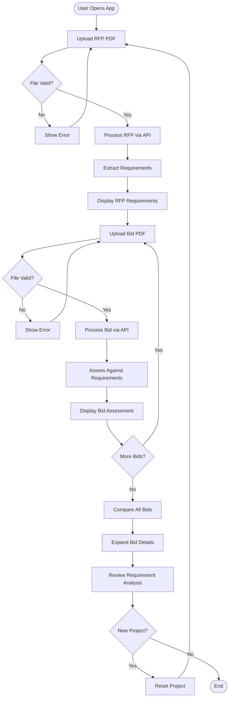

# RFP Bid Assessment Tool

A Next.js application that helps organizations efficiently evaluate multiple bids against Request for Proposal (RFP) requirements. Upload an RFP document, and the tool automatically extracts requirements and assesses how well each bid satisfies them.

## Overview

The RFP Bid Assessment Tool streamlines the bid evaluation process by:

- **Automatically extracting requirements** from RFP PDF documents and organizing them by category
- **Assessing bid compliance** by analyzing bid documents against RFP requirements
- **Providing detailed scoring** with satisfaction percentages and requirement-by-requirement analysis
- **Enabling side-by-side comparison** of multiple bids with expandable detail views

## Features

- 📄 **PDF Upload**: Drag-and-drop or file picker interface for uploading RFP and bid documents
- 🤖 **AI-Powered Extraction**: Automatic requirement extraction and categorization using Claude Sonnet 4.5
- ✅ **Requirement Assessment**: Each bid is evaluated against all RFP requirements with satisfaction status
- 📊 **Visual Scoring**: Color-coded satisfaction percentages (green/yellow/red) for quick comparison
- 📋 **Detailed Analysis**: Expandable bid cards showing requirement-by-requirement assessment with reasoning
- 💾 **Local Persistence**: Project data automatically saved to browser localStorage
- 🌙 **Dark Mode**: Full dark mode support for comfortable viewing
- 🔄 **Multiple Bids**: Upload and compare multiple bids against the same RFP
- 🆕 **Project Management**: Easy project reset to start fresh assessments

## Tech Stack

- **Framework**: Next.js 16 (App Router)
- **UI Library**: React 19
- **Language**: TypeScript
- **Styling**: Tailwind CSS 4
- **AI Integration**: AI SDK with Anthropic Claude Sonnet 4.5
- **File Storage**: Vercel Blob Storage (temporary)
- **Validation**: Zod for schema validation
- **Package Manager**: pnpm

## Architecture

### Application Structure

The application follows Next.js App Router conventions:

```
src/
├── app/
│   ├── api/
│   │   ├── process-rfp/
│   │   │   └── route.ts      # RFP processing endpoint
│   │   └── process-bid/
│   │       └── route.ts      # Bid assessment endpoint
│   ├── page.tsx              # Main application UI
│   ├── layout.tsx             # Root layout
│   └── globals.css           # Global styles
```

### API Routes

#### `/api/process-rfp` (POST)

Processes an RFP PDF document and extracts structured data.

**Request:**
- Method: `POST`
- Body: `FormData` with `file` field containing a PDF file

**Response:**
```typescript
{
  output: {
    title: string;
    rawText: string;
    requirements: Array<{
      text: string;
      category: string;
    }>;
  }
}
```

**Process:**
1. Validates PDF file (type and 10MB size limit)
2. Uploads file to Vercel Blob storage temporarily
3. Uses Claude Sonnet 4.5 to extract title, raw text, and categorized requirements
4. Cleans up temporary blob file
5. Returns structured RFP data

#### `/api/process-bid` (POST)

Processes a bid PDF document and assesses it against RFP requirements.

**Request:**
- Method: `POST`
- Body: `FormData` with:
  - `file`: PDF file
  - `requirements`: JSON stringified array of RFP requirements

**Response:**
```typescript
{
  output: {
    title: string;
    rawText: string;
    totalCost: number;
    timeline: string;
    requirements: Array<{
      text: string;
      category: string;
      isSatisfied: boolean;
      reason: string;
    }>;
  }
}
```

**Process:**
1. Validates PDF file and requirements JSON
2. Uploads file to Vercel Blob storage temporarily
3. Uses Claude Sonnet 4.5 to extract bid information and assess each requirement
4. Cleans up temporary blob file
5. Returns bid data with requirement satisfaction analysis

### Data Flow

1. **RFP Processing Flow**:
   - User uploads RFP PDF → File validated → Uploaded to Vercel Blob → Claude extracts requirements → Data returned → Blob cleaned up → Requirements displayed

2. **Bid Assessment Flow**:
   - User uploads bid PDF → File validated → Uploaded to Vercel Blob → Claude assesses against RFP requirements → Data returned → Blob cleaned up → Bid added to comparison list

3. **Client-Side State**:
   - RFP data and bids stored in React state
   - Automatically persisted to localStorage
   - Restored on page reload

## User Flows

### Primary Workflow



### Key User Actions

1. **Upload RFP**: Drag-and-drop or click to upload RFP PDF (max 10MB)
2. **View Requirements**: Automatically extracted requirements displayed by category
3. **Upload Bids**: Upload multiple bid PDFs (one at a time)
4. **Review Assessments**: Each bid shows:
   - Satisfaction percentage
   - Total cost
   - Timeline
   - Requirement-by-requirement analysis
5. **Compare Bids**: Side-by-side comparison with expandable detail views
6. **Start New Project**: Reset button clears all data and starts fresh

## Getting Started

### Prerequisites

- Node.js 18+ 
- pnpm (package manager)
- Vercel account (for Blob storage)
- Anthropic API key

### Installation

1. Clone the repository:
```bash
git clone <repository-url>
cd rfp-mvp
```

2. Install dependencies:
```bash
pnpm install
```

3. Set up environment variables:

Create a `.env.local` file in the root directory:

```env
# Vercel Blob Storage
BLOB_READ_WRITE_TOKEN=your_vercel_blob_token

# Anthropic API Key
ANTHROPIC_API_KEY=your_anthropic_api_key
```

**Getting your tokens:**
- **Vercel Blob Token**: Create a Vercel account, go to Storage → Blob, create a store, and copy the read/write token
- **Anthropic API Key**: Sign up at [console.anthropic.com](https://console.anthropic.com) and create an API key

4. Run the development server:
```bash
pnpm dev
```

5. Open [http://localhost:3000](http://localhost:3000) in your browser

### File Requirements

- **File Format**: PDF only (`.pdf`)
- **Maximum Size**: 10MB per file
- **RFP Documents**: Should contain clear requirements that can be extracted
- **Bid Documents**: Should be structured proposals responding to the RFP

## Project Structure

```
rfp-mvp/
├── src/
│   └── app/
│       ├── api/
│       │   ├── process-rfp/      # RFP processing API route
│       │   └── process-bid/      # Bid assessment API route
│       ├── page.tsx              # Main application page (client component)
│       ├── layout.tsx            # Root layout with fonts
│       └── globals.css           # Global Tailwind styles
├── public/                       # Static assets
├── package.json                  # Dependencies and scripts
├── tsconfig.json                 # TypeScript configuration
├── next.config.ts                # Next.js configuration
├── postcss.config.mjs            # PostCSS configuration
└── eslint.config.mjs             # ESLint configuration
```

## API Documentation

### POST /api/process-rfp

Extracts structured data from an RFP PDF document.

**Request Body:**
- `file` (File): PDF file (max 10MB)

**Success Response (200):**
```json
{
  "output": {
    "title": "RFP Title",
    "rawText": "Full document text in markdown...",
    "requirements": [
      {
        "text": "Requirement description",
        "category": "Technical"
      }
    ]
  }
}
```

**Error Responses:**
- `400`: Invalid file type, file too large, or no file provided
- `500`: Processing error

### POST /api/process-bid

Assesses a bid document against RFP requirements.

**Request Body:**
- `file` (File): PDF file (max 10MB)
- `requirements` (string): JSON stringified array of RFP requirements

**Success Response (200):**
```json
{
  "output": {
    "title": "Bid Title - Company Name",
    "rawText": "Full document text in markdown...",
    "totalCost": 150000,
    "timeline": "6 months",
    "requirements": [
      {
        "text": "Requirement description",
        "category": "Technical",
        "isSatisfied": true,
        "reason": "Bid explicitly addresses this requirement..."
      }
    ]
  }
}
```

**Error Responses:**
- `400`: Invalid file type, file too large, missing requirements, or invalid JSON
- `500`: Processing error

## Development

### Available Scripts

- `pnpm dev` - Start development server
- `pnpm build` - Build for production
- `pnpm start` - Start production server
- `pnpm lint` - Run ESLint

### Key Implementation Details

- **File Upload**: Uses HTML5 drag-and-drop and file input with automatic processing
- **State Management**: React hooks (useState, useEffect) with localStorage persistence
- **Error Handling**: Comprehensive error handling with user-friendly messages
- **File Cleanup**: Temporary blob files are automatically deleted after processing
- **Responsive Design**: Mobile-first responsive layout with Tailwind CSS

## Deployment

The easiest way to deploy this Next.js app is using the [Vercel Platform](https://vercel.com):

1. Push your code to a Git repository
2. Import the project in Vercel
3. Add environment variables:
   - `BLOB_READ_WRITE_TOKEN`
   - `ANTHROPIC_API_KEY`
4. Deploy!

The app will automatically use Vercel Blob storage when deployed on Vercel.

## Learn More

- [Next.js Documentation](https://nextjs.org/docs)
- [AI SDK Documentation](https://sdk.vercel.ai/docs)
- [Vercel Blob Storage](https://vercel.com/docs/storage/vercel-blob)
- [Anthropic Claude API](https://docs.anthropic.com)

## License

This project is private and proprietary.
